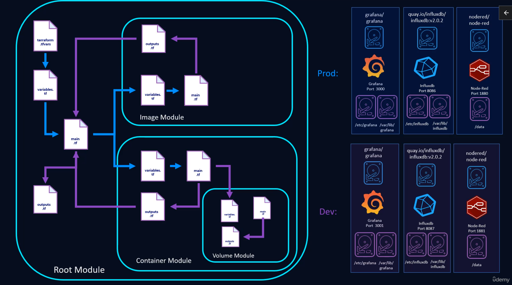

# terraform-aws
This was from the course 'More than Certified in Terraform' by Derek Moran.  Most of this code is following what was written in his course. Some of the files might not be included due to sensitive information.

This was created while following videos in 'Section 2: Terraform Basics and Docker' & 'Section 3: Modular Deployments'.

# Source content
Lesson plan files: https://github.com/morethancertified/mtc-terraform/tree/main/03-modular-deployments
More Than Certified Terraform - Derek Morgan - https://courses.morethancertified.com/p/mtc-terraform
